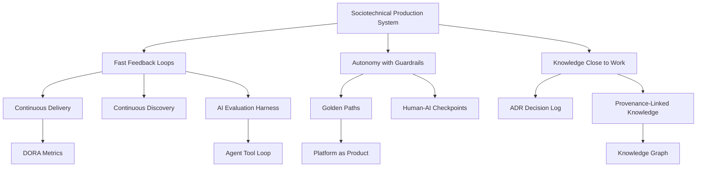

# Research Map

Task ID: `GLOBAL_RESEARCH_INTELLIGENT_PRODUCTION_SYSTEMS`
Status: v1
Date: 2026-07-02

## Domain Map

| Domain | Research focus | Representative sources | Extracted knowledge examples |
| --- | --- | --- | --- |
| Software Engineering | Delivery flow, SDLC, code review, release engineering, engineering productivity | S01, S03, S04, S08, S09, S10 | fast feedback, small batches, continuous delivery, modern code review, DORA/SPACE metrics |
| Software Architecture | Architecture decisions, stakeholder concerns, review, decision traceability | S07, S28, S29 | architecture review by viewpoints, ADR decision logs, decision technique ADR |
| Platform Engineering | Internal developer platforms, platform-as-product, golden paths, maturity | S11, S12, S13, S35 | platform as product, golden paths, platform maturity, portal-not-platform anti-pattern |
| Product Development | Discovery, outcome orientation, product trio, feature factory risk | S14, S15, S16 | continuous discovery, opportunity solution tree, product trio, feature factory anti-pattern |
| AI Engineering | Agents, coding agents, orchestration, evals, memory, human-AI collaboration | S17, S18, S19, S20, S21, S22 | agent tool loop, agent-computer interface, AI eval harness, human-AI checkpoints |
| Quality | Verification, validation, secure-by-design, quality attributes, testing concepts | S06, S10, S33, S34 | built-in quality, secure SDLC, ISO 25010 quality model, testing standards as vocabulary |
| Knowledge Management | Documentation systems, organizational memory, provenance, knowledge graphs | S28, S29, S30, S31, S32 | atomic KB records, provenance-linked knowledge, Diataxis, knowledge graph |
| Governance | AI risk, management systems, decision authority, metrics, maturity models | S08, S12, S23, S24 | NIST AI RMF, ISO 42001, SPACE, platform maturity, autonomy with guardrails |
| Adjacent Disciplines | Lean, TPS, checklists, incident learning, high-reliability coordination | S25, S26, S27, S04 | kaizen, A3 problem solving, pause-point checklists, incident management |

## Relationship Map

## Coverage Notes

- Software engineering and AI engineering have the strongest evidence coverage.
- Product operating model evidence is strong as practitioner literature but less formal empirically.
- Adjacent disciplines are included as transferable abstractions, not direct templates.
- AI-agent knowledge is marked as evolving or volatile where implementation details are fast-changing.

