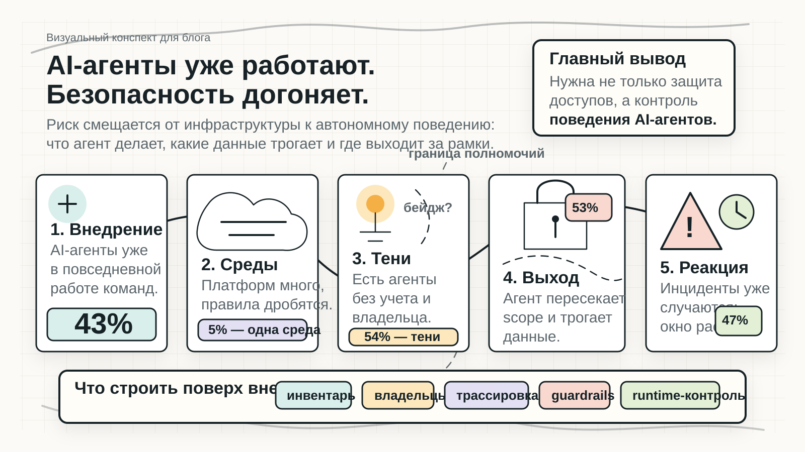

# AI-агенты уже работают. Безопасность догоняет

AI-агенты уже встроены в повседневную работу компаний, но контроль за ними развивается медленнее, чем внедрение. Главный риск смещается от инфраструктуры и прав доступа к автономному поведению: что агент делает, какие данные трогает, кому принадлежит и где выходит за рамки ожидаемого сценария.

## Как читать схему

Слева направо: массовое внедрение → множество платформ → теневые агенты и размытая ответственность → выход за границы полномочий → инциденты и медленная реакция.

Нижний слой показывает, что нужно достроить поверх внедрения: инвентаризацию агентов, владельцев, трассировку действий, guardrails и runtime-контроль.

## Ключевые числа для подписи

- 43% организаций говорят, что больше половины сотрудников регулярно используют AI-агентов.
- Только 5% используют одну агентскую платформу; остальные живут в нескольких средах.
- 54% видят от 1 до 100 несанкционированных AI-агентов.
- 53% сообщают, что агенты иногда выходят за заданные полномочия.
- 47% сообщили об инциденте с AI-агентом за последние 12 месяцев.
- 13% чувствуют высокую готовность к будущему AI-регулированию.

## Готовая подпись

AI-агенты становятся частью цифровой рабочей силы быстрее, чем компании успевают выстроить инвентаризацию, владельцев, трассировку и контроль поведения. Поэтому периметр безопасности постепенно смещается от систем к действиям автономных агентов.

## Alt-текст

Визуальный конспект показывает путь корпоративных AI-агентов от массового внедрения к рискам управления. На схеме отмечены несколько платформ, теневые агенты без владельцев, пересечение границы полномочий рядом с чувствительными данными, инциденты и меры контроля: инвентарь, владельцы, трассировка, guardrails и runtime-контроль.
