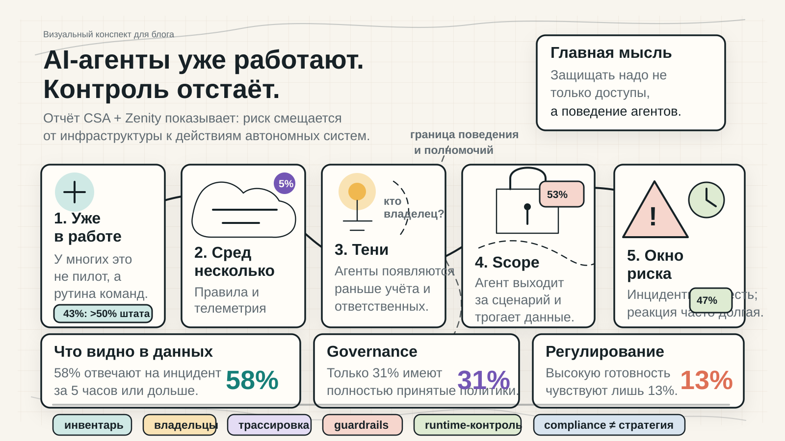

# AI-агенты уже работают. Контроль отстаёт от поведения

AI-агенты быстро становятся частью цифровой рабочей силы: они помогают сотрудникам, подключаются к нескольким платформам, работают с чувствительными данными и всё чаще действуют автономно. Главная проблема отчёта CSA и Zenity не в самом факте внедрения, а в том, что видимость, владельцы, трассировка и runtime-контроль не успевают за поведением агентов.

## Как читать схему

Слева направо: массовое использование → несколько агентских сред → теневые агенты и размытые владельцы → пересечение границ поведения → инциденты и длинное окно реакции.

Нижний ряд — практический слой, который нужно достроить поверх внедрения: инвентаризация агентов, назначение владельцев, трассировка действий, guardrails, runtime-контроль и собственная стратегия управления, а не только соответствие внешним требованиям.

## Ключевые числа для подписи

- 43% организаций сообщают, что больше половины сотрудников регулярно используют AI-агентов.
- Только 5% используют одну агентскую платформу; большинство живёт в нескольких средах.
- 53% говорят, что агенты иногда или периодически выходят за заданные полномочия.
- 47% уже сталкивались с инцидентом с участием AI-агента за последние 12 месяцев.
- 58% отвечают на такие инциденты за 5 часов или дольше.
- 13% чувствуют высокую готовность к будущему регулированию AI-агентов.

## Готовая подпись

AI-агенты уже встроены в рабочие процессы компаний, но безопасность должна научиться управлять не только доступами, а поведением автономных систем: кто владеет агентом, что он делает, какие данные затрагивает, где выходит за scope и как быстро это можно обнаружить.

## Alt-текст

Визуальный конспект показывает путь корпоративных AI-агентов от массового внедрения к управленческому разрыву. На схеме отмечены несколько платформ, теневые агенты без понятных владельцев, пересечение границы поведения, инциденты, длительное окно реакции и нужные меры контроля: инвентарь, владельцы, трассировка, guardrails, runtime-контроль и стратегия вместо одной только compliance-логики.

Источник: Cloud Security Alliance и Zenity, отчет `Enterprise AI Security Starts with AI Agents`, 2026; опрос 445 IT- и security-специалистов.
